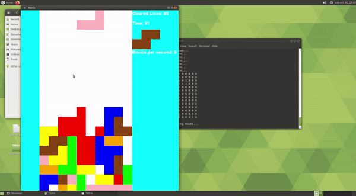

# Tetris Bot

## Table of Contents

* [About the Project](#about-the-project)
* [How it works](#how-it-works)
* [Issue](#issue)
* [Getting Started](#getting-started)
  * [Prerequisites](#prerequisites)
  * [Installation](#installation)
* [Contact](#contact)

## About the project

The good old tetris, however, in this version you can choose a bot to play for you!\


## How it works

The bot tries all different ways it can put the piece and for each time it calculates a score.
The score is based on how the playing field looks, e.g, a full line gives a very high score while holes reduces the score.

When the game start you get to choose if you want the bot to play or play yourself.
Then a speed is choosen. The speed is how many milliseconds the bot will sleep inbetween its moves.

## Issue

The game is not thread safe and can crash, its more likely if the bot is run at a high speed.

## Getting Started

### Prerequisites
- GCC compiler
```sh
sudo apt-get install gcc
```
```sh
sudo apt-get install build-essential
```
- SFML
```sh
sudo apt-get install libsfml-dev
```

### Installation

1. Clone the repository
2. Type "make" in the root folder to compile the project
3. Type "bin/game" to start the game

## Contact

Tobias Mellberg - Tobbemellberg@hotmail.se
